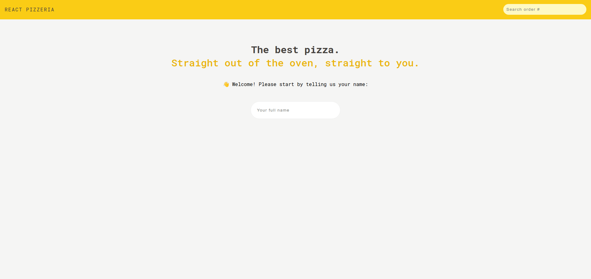
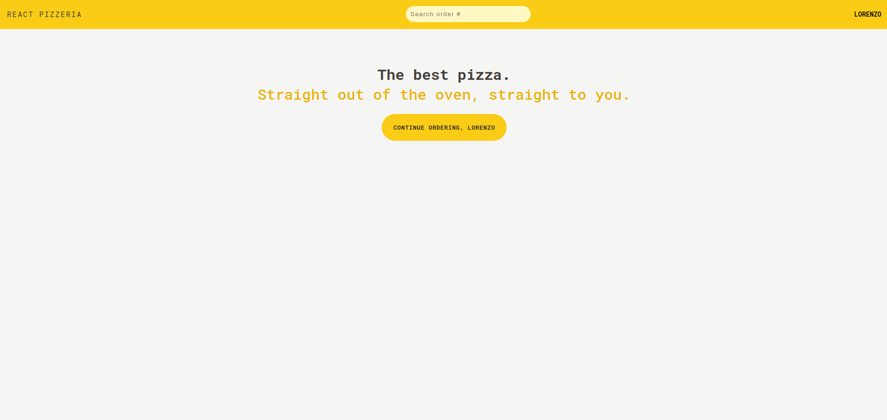
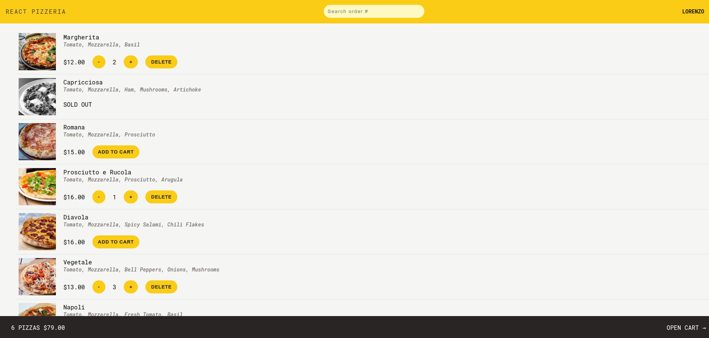
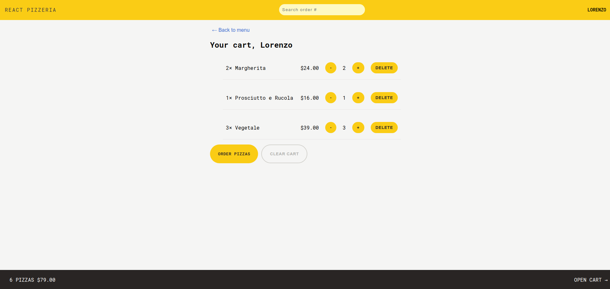
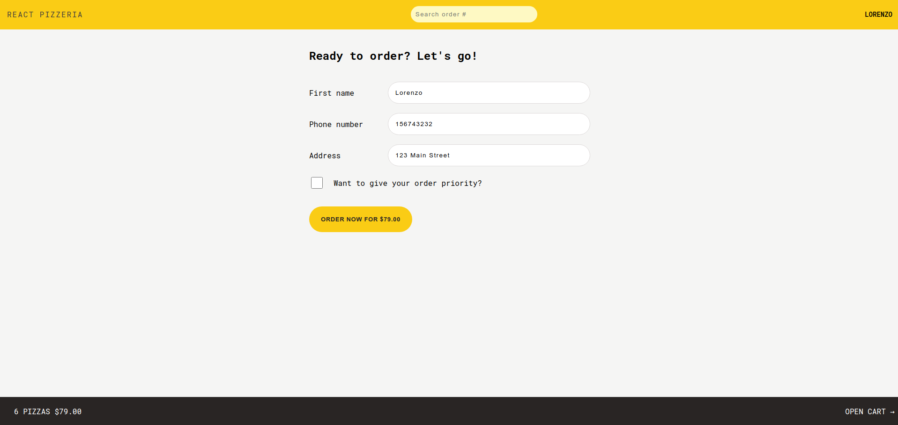
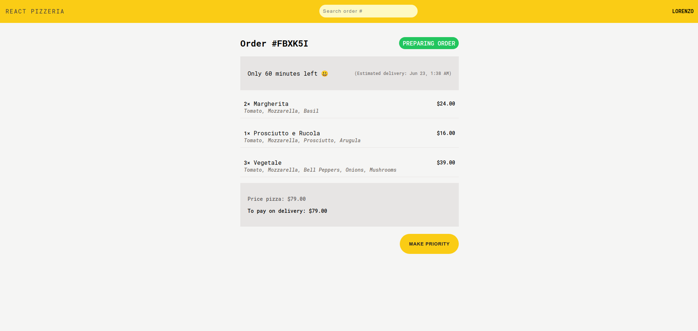
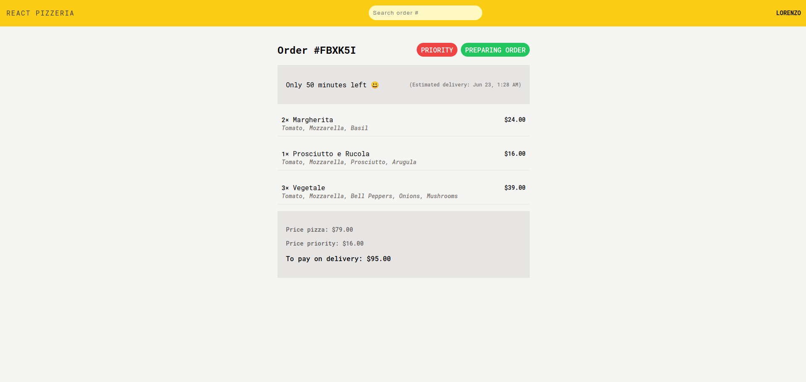
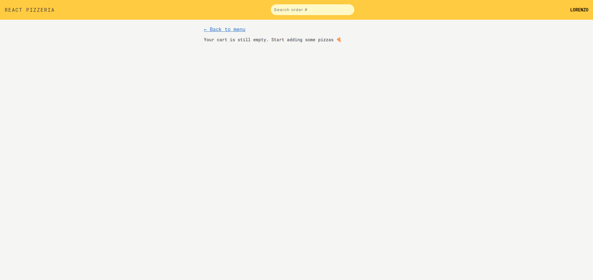

# React Pizzeria

React Pizzeria is a web application for ordering pizzas, built using React and React Router. The app provides an intuitive interface to browse the pizza menu, add items to the cart, create new orders, and view the status of existing orders. It uses Redux for state management, ensuring a smooth and responsive user experience.

## Features

- **Navigation and Layout**

  - **AppLayout**: Main layout of the application, including the header, main content, and a cart overview.
  - **RouterProvider**: Router configuration to handle various routes within the application.
  - **Error Handling**: Comprehensive error handling for loading and navigation using the `Error` component.

- **Home Page**

  - **Home**: The application's welcoming home page, accessible via the `/` route. Displays a greeting message and a prompt to start ordering.

- **Menu**

  - **Menu**: Displays a list of available pizzas with details such as name, ingredients, and price.
  - **MenuItem**: Component for each menu item, allowing users to add, remove, and adjust the quantity of items in the cart.
  - **Loader**: `loader` function to fetch menu data from the server.

- **Cart**

  - **Cart**: Shows the current items in the cart with options to modify quantities or remove items.
  - **CartItem**: Component for each item in the cart with controls for increasing or decreasing quantity and removing the item.
  - **CartOverview**: Overview of the cart showing the total number of items and total price, with a link to open the cart.
  - **EmptyCart**: Displayed when the cart is empty, with a link to go back to the menu.

- **Order Management**

  - **CreateOrder**: Form to create a new order with customer details and the option to prioritize the order.
  - **Order**: Displays the details of a specific order, including status, estimated delivery time, and order items.
  - **OrderItem**: Component for each item in an order, showing the quantity, name, price, and ingredients.
  - **UpdateOrder**: Allows updating the order to give it priority.
  - **SearchOrder**: Form to search for an order by its ID.

- **User Management**

  - **CreateUser**: Form to create a new user by entering their name.
  - **Username**: Displays the username of the current user.

- **Utilities and Helpers**

  - **formatCurrency**: Formats numbers as currency.

  - **formatDate**: Formats dates in a user-friendly way.

  - **calcTimeLeft**: Calculates the time left until a specified date in minutes.

  - **isValidPhone**: Validates phone numbers based on a specific pattern.

## Screenshots

















## Installation

1. Clone the repository:

   ```bash
   git clone https://github.com/lucchesilorenzo/react-pizzeria.git
   cd react-pizzeria
   ```

2. Install dependencies:

   ```bash
   npm install
   ```

3. Start the development server:
   ```bash
   npm run dev
   ```
